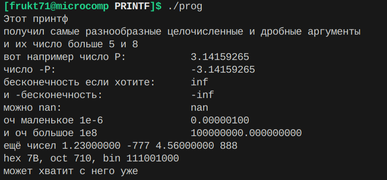

# MyPrintf

## Задача
Нужно было написать свою версию стандартной функции printf(), реализовав некоторые спецификаторы. Код написан на ассемблере NASM.

## Сборка программы
Для сборки нужно создать объектный файл my_printf.o (пример для Linux x86-64):

```nasm -f elf64 my_printf.asm -o my_printf.o```

и затем слинковать его со всей программой компилятором `g++` используя флаг `no-pie`

```g++ -no-pie -o prog main.o my_printf.o```

## Использование функции
В вашей программе должна быть объявлена функция MyPrintf

```extern "C" void MyPrintf(const char* str, ...);```

Затем её можно использовать так же, как и стандартную: первым аргументом идёт форматная строка, а за ней аргументы, соответствующие спецификаторам.

## Реализованные спецификаторы
|Спецификатор| Описание                                         |
|--|------------------------------------------------------------|
|`%%`| печатает символ `%`                                      |
|`%c`| печатает один символ (байт), переданный в аргументе      |
|`%s`| печатает строку, адрес которой передан в аргументе       |
|`%d`| печатает значение аргумента в формате знакового целого   |
|`%b`| печатает значение аргумента в двоичной форме             |
|`%o`| печатает значение аргумента в восьмеричной форме         |
|`%x`| печатает значение аргумента в шестнадцатеричной форме    |
|`%f`| печатает значение дробного числа с двойной точностью     |


## Реализация стандарта `System V AMD64 ABI`
В линуксе x86-64 поддерживается стандарт вызова функций `System V AMD64 ABI`. В соответствии с ним первые 6 целочисленных аргументов передаются через регистры `rdi` .. `r9`, а остальные через стек в обратном порядке; первые 8 аргументов с плавающей точкой передаются в регистрах `xmm0` .. `xmm1`, а остальные через стек в обратном порядке.

Для поддержания этого стандарта функцией с переменным количеством аргументов я написал обёртку, которая в начале функции достаёт из стека адрес возврата, который туда положила команда call, пушит сначала регистры `rsi` .. `r9`, `xmm0` .. `xmm1` в обратном порядке, а затем возвращает в стек сохранённый адрес возврата.

Верхняя обёртка функции MyPrintf:
```
        pop rax             ; return addr -> rax

        ; 2..n args in stack, rdi remains eq format str
        push r9             ; 2-6 usual args
        push r8
        push rcx
        push rdx
        push rsi

        sub rsp, 8          ; 1-8 double args
        movsd [rsp], xmm7
        sub rsp, 8
        movsd [rsp], xmm6
        sub rsp, 8
        movsd [rsp], xmm5
        sub rsp, 8
        movsd [rsp], xmm4
        sub rsp, 8
        movsd [rsp], xmm3
        sub rsp, 8
        movsd [rsp], xmm2
        sub rsp, 8
        movsd [rsp], xmm1
        sub rsp, 8
        movsd [rsp], xmm0

        push rax            ; return addr -> stack


        push rbp            ; install the stack frame
        mov  rbp, rsp
```

За этим идёт сам код функции MyPrintf. В конце стек возвращается к изначальному состоянию.

Нижняя обёртка функции MyPrintf:
```
        leave
        pop  rax            ; save ret addr
        add  rsp, 13 * 8    ; clean up the stack after yourself
        push rax            ; ret addr back to where it was
        ret
```

Адресация к аргументам реализуется следующим образом: в регистре `cl` лежит количество обработанных на текущий момент целочисленных аргументов, а в `ch` - аргументов с плавающей запятой.

Тогда текущий целочисленный аргумент `int_arg` можно получить по следующему алгоритму:
```
если cl < 5
    // аргумент до функции находился в одном из регистров и мы запушили его в стек
    // смещаемся на 16 байт, обойдя запушенные rbp и rax, и на 8 * 8 = 64 байта, обойдя 
    // запушенные регистры xmm
    int_arg = [rbp + cl * 8 + 16 + 8 * 8]  

иначе           
    // аргумент изначально лежит в стеке
    // он смещен на некоторое расстояние от rbp + 16 + (8 + 5) * 8
    // это расстояние = количество обработанных на данный момент
    // целочисленных + дробных аргументов, изначально переданных через стек
    cl = (cl > 5) ? cl - 5 : 0
    ch = (ch > 8) ? ch - 8 : 0
    rcx = cl = ch
    int_arg = [rbp + rcx * 8 + 16 + (8 + 5) * 8]
```

А текущий дробный аргумент `double_ard` можно получить аналогично, используя эту же идею.

Для наглядности представлю образ стека после выполнения верхней обёртки

|Стек (растёт вниз)| |
|----|---|
|`...`                            |какие-то данные...|
|`... аргументы функции MyPrintf` | |
|`... переданные через стек`      | <-- [rbp + 16 + (5 + 8) * 8]|
|`r9`                             |                 |
|`r8`                             |                 |
|`rcx`                            |                 |
|`rdx`                            |                 |
|`rsi`                            | <-- [rbp + 16 + 8 * 8]|
|`xmm7`                           |                 |
...
|`xmm0`                           | <-- [rbp + 16]  |
|`rax`                            | в `rax` сохраняли адрес возврата|
|`rbp`                            |                 |
| свободная память                            | <-- [rbp]                |


## Реализация спецификатора `%f`
Для определения целой и дробной части числа я использовал специальные операции над регистрами `xmm`. Сначала по значениям полей `exp` и `frac` определяется, является ли формат числа особенным (NAN или бесконечность).

Взятие целой части:
```
        roundsd xmm1, xmm0, 3   ; округление в сторону нуля  
        cvttsd2si rax, xmm1     ; rax = целая часть
```

и дробной части:
```
        movsd xmm2, [taking_modulo_mask]    ; обнуление старшего (знакового) бита
        andpd xmm0, xmm2
        andpd xmm1, xmm2
        subsd xmm0, xmm1                    ; xmm0 = 0.дробная_часть

        movsd xmm1, [FracMultiplier]    ; xmm0 = 10^8
        mulsd xmm0, xmm1                ; дробная часть с точностью до 8 знака после запятой
        cvttsd2si rax, xmm0             ; rax = дробная_часть
```

Получив отдельные значения целой и дробной части, их можно напечатать так же, как числа в `%d`. 


## Примеры работы

Приведу результат работы этого вызова функции MyPrintf:
```
    MyPrintf("Этот принтф \n%s %s \nи их число больше %d и %d\n"                                 
            "вот например число %c: \t\t%f\n" 
            "число -P:\t\t\t%f\n"
            "%s если хотите:    \t%f\n"
            "и %cбесконечность: \t\t%f\n"
            "можно %s: \t\t\t%f\n"
            "оч маленькое 1e-%d \t\t%f\n"
            "и оч большое 1e%d\t\t%f\n"
            "ещё чисел %f %d %f %d\n"
            "hex %x, oct %o, bin %b\n"
            "может хватит с него уже\n\n\n",
    "получил самые разнообразные", "целочисленные и дробные аргументы", 5, 8, 'P',
    M_PI, -M_PI, "бесконечность", INFINITY, '-', -INFINITY, "nan", NAN, 6, 1e-6, 8, 1e8, 1.23, -777, 4.56, 888,
    123, 456, 789);
```

